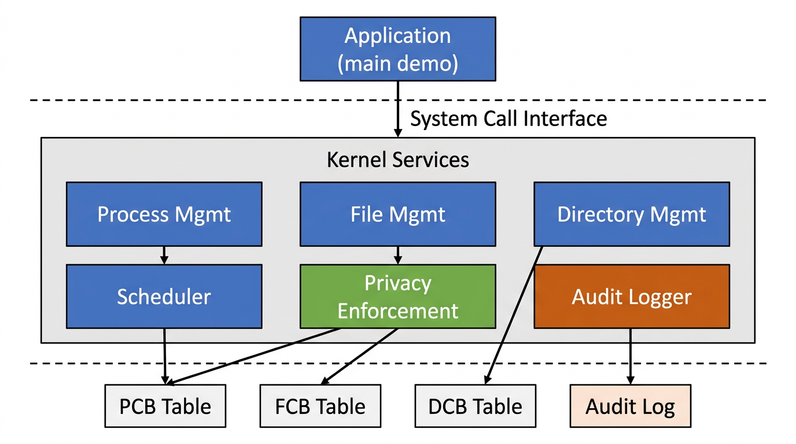

# Mini Privacy-First OS Kernel — Final Project Report

## Table of Contents

1. [Design Diagram](#1-design-diagram)
2. [Component Explanations](#2-component-explanations)
3. [System Call Design: `mkdir()`](#3-system-call-design-mkdir)
4. [Pseudo-Code for `mkdir()`](#4-pseudo-code-for-mkdir)
5. [Implementation](#5-implementation)
6. [Demo Output](#6-demo-output)

---

## 1. Design Diagram



The diagram above shows the three-layer architecture of the mini OS kernel:

- **User Space** — The application (demo driver in `main()`) makes requests by invoking system calls.
- **Kernel Services** — The kernel handles those requests through six service modules: Process Management, File Management, Directory Management, the Scheduler, Privacy Enforcement, and the Audit Logger.
- **Kernel Data Structures** — Each service operates on in-memory data structures: the Process Table (PCB array), File Table (FCB array), Directory Table (DCB array), and the Audit Log.

The dashed lines represent the privilege boundary. In a real OS this would be enforced by hardware (user mode vs. kernel mode); in our simulation it is represented by the function-call interface between `main()` and the `sys_*` functions.

---

## 2. Component Explanations

### 2.1 Process Management (`process.c`)

The Process Management module is responsible for creating and tracking processes. Each process is represented by a **Process Control Block (PCB)**, which stores:

| Field       | Purpose                                      |
|-------------|----------------------------------------------|
| `pid`       | Unique process identifier                    |
| `state`     | Current state: READY, RUNNING, BLOCKED, or TERMINATED |
| `reg_ax`, `reg_bx` | Simulated CPU registers                |
| `mem_base`, `mem_size` | Simulated memory allocation           |
| `time_left` | Remaining time quantum for scheduling        |
| `active`    | Whether this PCB slot is in use              |

The system call `sys_create_process()` scans the process table for an inactive slot, initializes a new PCB with a unique PID and a READY state, and returns the PID to the caller. The table has a fixed capacity of 8 processes (`MAX_PROCESSES`), simulating the finite resources of a real system.

### 2.2 File Management (`filesystem.c`)

The File Management module provides five system calls for file I/O: `open`, `read`, `write`, `close`, and `lseek`. Each open file is tracked by a **File Control Block (FCB)** containing:

| Field        | Purpose                                       |
|--------------|-----------------------------------------------|
| `fd`         | File descriptor (index into the file table)   |
| `name`       | Human-readable filename                       |
| `data`       | In-memory buffer holding the file contents    |
| `size`       | Current size of the file in bytes             |
| `position`   | Read/write position pointer                   |
| `owner_pid`  | PID of the process that created the file      |
| `is_open`    | Whether this file is currently open           |

Every file operation first validates the file descriptor, then checks that the calling process owns the file (privacy enforcement). This per-file ownership model ensures that one process cannot read, write, seek, or close another process's files.

### 2.3 Directory Management (`directory.c`)

The Directory Management module handles the creation and listing of directories through the `sys_mkdir()` system call. Each directory is represented by a **Directory Control Block (DCB)**:

| Field        | Purpose                                       |
|--------------|-----------------------------------------------|
| `dir_id`     | Unique directory identifier                   |
| `name`       | Directory name                                |
| `owner_pid`  | PID of the process that created the directory |
| `is_active`  | Whether this directory slot is in use         |

The module enforces uniqueness (no two directories can share the same name) and tracks ownership for auditability.

### 2.4 Scheduler (`process.c`)

The Scheduler implements a **round-robin** dispatching algorithm. On each tick, it iterates through the process table and dispatches every READY process in order, assigning it a fresh time quantum (`TIME_QUANTUM = 3`). In a real OS, the scheduler would context-switch between processes using hardware timer interrupts; here it is simulated by the `scheduler_tick()` function to demonstrate the concept.

### 2.5 Privacy Enforcement

Privacy enforcement is embedded throughout the kernel rather than being a standalone module. Every system call that accesses a file or directory compares the caller's PID against the resource's `owner_pid`. If they do not match, the operation is denied with a return code of `-2` and a `[PRIVACY]` message is printed. This simulates access control in a real OS, where the kernel prevents unauthorized processes from accessing resources they do not own.

### 2.6 Audit Logger (`audit.c`)

The Audit Logger records every system call into a kernel-wide audit log. Each entry captures:

| Field       | Purpose                                        |
|-------------|-------------------------------------------------|
| `timestamp` | Logical clock tick when the call occurred       |
| `pid`       | Which process made the call                     |
| `syscall`   | Name of the system call (e.g., "write", "mkdir")|
| `fd`        | File descriptor involved (-1 if not applicable) |
| `result`    | Return value (0 = success, negative = error)    |

This provides a complete, tamper-evident trail of all kernel activity — useful for debugging, forensics, and demonstrating that privacy violations were correctly blocked.

---

## 3. System Call Design: `mkdir()`

### 3.1 Purpose

The `mkdir(dirname)` system call creates a new directory in the kernel's directory table. It is analogous to the POSIX `mkdir()` call, which creates a new directory entry in the filesystem. In a real OS, this would allocate an inode and link it into the parent directory's block; in our simulation, it reserves a slot in the fixed-size `dir_table[]` array.

### 3.2 Parameters

| Parameter | Type           | Description                               |
|-----------|----------------|-------------------------------------------|
| `pid`     | `int`          | The PID of the calling process            |
| `dirname` | `const char *` | The name of the directory to create       |

### 3.3 Return Values

| Value  | Meaning                                       |
|--------|-----------------------------------------------|
| `>= 0` | Success — returns the `dir_id` of the new directory |
| `-1`   | Invalid directory name or directory table full |
| `-4`   | A directory with that name already exists      |

### 3.4 Step-by-Step Design

The `mkdir()` system call follows a four-step pipeline:

```
  ┌─────────────────────┐
  │  1. Validate Input  │  Is dirname non-NULL and non-empty?
  └────────┬────────────┘
           │ yes
           ▼
  ┌─────────────────────┐
  │ 2. Duplicate Check  │  Scan dir_table for matching name
  └────────┬────────────┘
           │ no duplicate found
           ▼
  ┌─────────────────────┐
  │ 3. Allocate Slot    │  Find first inactive entry in dir_table
  └────────┬────────────┘
           │ slot found
           ▼
  ┌─────────────────────┐
  │ 4. Initialize & Log │  Fill in DCB fields, log to audit trail
  └─────────────────────┘
```

**Step 1 — Validate Input:**
The kernel checks that the `dirname` pointer is not NULL and the string is not empty. If validation fails, the call returns `-1` immediately. This prevents the kernel from operating on garbage data.

**Step 2 — Duplicate Check:**
The kernel iterates through all 16 slots of `dir_table[]`. For each active entry (`is_active == 1`), it compares the existing name against the requested `dirname` using `strncmp()`. If a match is found, the call returns `-4` and logs the failure to the audit trail. This enforces the filesystem invariant that directory names must be unique within the same namespace.

**Step 3 — Allocate a Free Slot:**
The kernel makes a second pass through `dir_table[]`, looking for the first entry where `is_active == 0`. This is a simple linear scan, analogous to how a real OS would search its inode bitmap for a free inode. If no free slot exists, the call returns `-1` (table full).

**Step 4 — Initialize and Log:**
Once a free slot is found, the kernel populates the DCB:
- `dir_id` is set to the slot index
- `owner_pid` is set to the calling process's PID
- `is_active` is set to 1 (marking the slot as used)
- `name` is copied from `dirname` using `strncpy()` to prevent buffer overflow

Finally, the kernel calls `log_syscall()` to record the operation in the audit log and returns the `dir_id` to the caller.

### 3.5 Error Handling Summary

| Condition             | Action                              | Return |
|-----------------------|-------------------------------------|--------|
| NULL or empty name    | Print error, return immediately     | `-1`   |
| Name already exists   | Print error, log to audit           | `-4`   |
| Directory table full  | Print error                         | `-1`   |
| Success               | Initialize DCB, log to audit        | `dir_id` |

---

## 4. Pseudo-Code for `mkdir()`

```
FUNCTION sys_mkdir(pid, dirname):

    // --- Step 1: Validate input ---
    IF dirname is NULL OR dirname is empty THEN
        PRINT "[ERROR] mkdir: invalid directory name"
        RETURN -1
    END IF

    // --- Step 2: Check for duplicate directory name ---
    FOR i FROM 0 TO MAX_DIRS - 1 DO
        IF dir_table[i].is_active == TRUE THEN
            IF dir_table[i].name == dirname THEN
                PRINT "[ERROR] mkdir: directory already exists"
                LOG_SYSCALL(pid, "mkdir", -1, -4)
                RETURN -4
            END IF
        END IF
    END FOR

    // --- Step 3: Find a free slot in the directory table ---
    FOR i FROM 0 TO MAX_DIRS - 1 DO
        IF dir_table[i].is_active == FALSE THEN

            // --- Step 4: Initialize the new directory entry ---
            dir_table[i].dir_id    = i
            dir_table[i].owner_pid = pid
            dir_table[i].is_active = TRUE
            dir_table[i].name      = COPY(dirname)

            PRINT "[DIR] PID=pid created directory 'dirname' (dir_id=i)"
            LOG_SYSCALL(pid, "mkdir", i, 0)
            RETURN i

        END IF
    END FOR

    // --- Step 5: No free slot available ---
    PRINT "[ERROR] mkdir: directory table full"
    RETURN -1

END FUNCTION
```

---

## 5. Implementation

The full C implementation is split across six source files:

| File            | Contents                                           |
|-----------------|----------------------------------------------------|
| `kernel.h`      | Shared types (PCB, FCB, DCB, AuditEntry), constants, prototypes |
| `kernel.c`      | Global state definitions, `kernel_init()`, `main()` demo |
| `process.c`     | `sys_create_process()`, `scheduler_tick()`          |
| `filesystem.c`  | `sys_open()`, `sys_write()`, `sys_read()`, `sys_close()`, `sys_lseek()` |
| `directory.c`   | `sys_mkdir()`, `print_dir_table()`                  |
| `audit.c`       | `log_syscall()`, `print_audit_log()`                |

### Building and Running

```bash
make            # compiles all source files
./mini_kernel   # runs the demo
```

Or manually:

```bash
gcc -Wall -Wextra -std=c99 -o mini_kernel kernel.c audit.c process.c filesystem.c directory.c
./mini_kernel
```

### System Calls Implemented (7 total)

| System Call          | Description                          |
|----------------------|--------------------------------------|
| `sys_create_process()` | Creates a new process with a unique PID |
| `sys_open(pid, filename)` | Opens a file and assigns a file descriptor |
| `sys_write(pid, fd, buffer, nbytes)` | Writes data to an owned file |
| `sys_read(pid, fd, buffer, nbytes)` | Reads data from an owned file |
| `sys_close(pid, fd)` | Closes an open file descriptor |
| `sys_lseek(pid, fd, offset)` | Repositions the file read/write pointer |
| `sys_mkdir(pid, dirname)` | Creates a new directory entry |

---

## 6. Demo Output

```
=== Mini Privacy-First OS Kernel Demo (Phase 2) ===

[KERNEL] Initialized. Process table: 8 slots, File table: 16 slots, Dir table: 16 slots.
[PROC] Created process PID=0
[AUDIT] tick=0 pid=0 syscall=create_process fd=-1 result=0
[PROC] Created process PID=1
[AUDIT] tick=1 pid=1 syscall=create_process fd=-1 result=0
[FILE] PID=0 opened 'notes.txt' as fd=0
[AUDIT] tick=2 pid=0 syscall=open fd=0 result=0
[WRITE] PID=0 wrote 21 bytes to fd=0 ('notes.txt')
[AUDIT] tick=3 pid=0 syscall=write fd=0 result=21

[TEST] Process 1 attempts unauthorized write:
[AUDIT] tick=4 pid=1 syscall=write fd=0 result=-2
[PRIVACY] write: PID=1 denied access to fd=0 (owned by PID=0)
[FILE] PID=1 opened 'secret.txt' as fd=1
[AUDIT] tick=5 pid=1 syscall=open fd=1 result=0
[WRITE] PID=1 wrote 20 bytes to fd=1 ('secret.txt')
[AUDIT] tick=6 pid=1 syscall=write fd=1 result=20

[TEST] Demonstrating lseek() — seek to start, then read:
[LSEEK] PID=0 seeked fd=0 to position 0
[AUDIT] tick=7 pid=0 syscall=lseek fd=0 result=0
[AUDIT] tick=8 pid=0 syscall=read fd=0 result=21
[READ] PID=0 read 21 bytes: 'Hello from process 0!'

[TEST] Seek to offset 6, read partial:
[LSEEK] PID=0 seeked fd=0 to position 6
[AUDIT] tick=9 pid=0 syscall=lseek fd=0 result=6
[AUDIT] tick=10 pid=0 syscall=read fd=0 result=15
[READ] PID=0 read 15 bytes from offset 6: 'from process 0!'

[TEST] Process 1 attempts unauthorized lseek:
[AUDIT] tick=11 pid=1 syscall=lseek fd=0 result=-2
[PRIVACY] lseek: PID=1 denied access to fd=0 (owned by PID=0)

[TEST] Demonstrating mkdir():
[DIR] PID=0 created directory 'documents' (dir_id=0)
[AUDIT] tick=12 pid=0 syscall=mkdir fd=0 result=0
[DIR] PID=0 created directory 'downloads' (dir_id=1)
[AUDIT] tick=13 pid=0 syscall=mkdir fd=1 result=0
[DIR] PID=1 created directory 'workspace' (dir_id=2)
[AUDIT] tick=14 pid=1 syscall=mkdir fd=2 result=0

[TEST] Attempt to create duplicate directory:
[ERROR] mkdir: directory 'documents' already exists
[AUDIT] tick=15 pid=0 syscall=mkdir fd=-1 result=-4

=== DIRECTORY TABLE ===
  [dir_id=0] 'documents'  owner_pid=0
  [dir_id=1] 'downloads'  owner_pid=0
  [dir_id=2] 'workspace'  owner_pid=1
=======================

[SCHEDULER] --- Tick ---
[SCHED] Dispatching PID=0
[SCHED] Dispatching PID=1
[FILE] PID=0 closed fd=0
[AUDIT] tick=16 pid=0 syscall=close fd=0 result=0
[FILE] PID=1 closed fd=1
[AUDIT] tick=17 pid=1 syscall=close fd=1 result=0

=== AUDIT LOG (18 entries) ===
  [  0] PID=0 create_process     fd=-1  result=0
  [  1] PID=1 create_process     fd=-1  result=0
  [  2] PID=0 open               fd=0   result=0
  [  3] PID=0 write              fd=0   result=21
  [  4] PID=1 write              fd=0   result=-2
  [  5] PID=1 open               fd=1   result=0
  [  6] PID=1 write              fd=1   result=20
  [  7] PID=0 lseek              fd=0   result=0
  [  8] PID=0 read               fd=0   result=21
  [  9] PID=0 lseek              fd=0   result=6
  [ 10] PID=0 read               fd=0   result=15
  [ 11] PID=1 lseek              fd=0   result=-2
  [ 12] PID=0 mkdir              fd=0   result=0
  [ 13] PID=0 mkdir              fd=1   result=0
  [ 14] PID=1 mkdir              fd=2   result=0
  [ 15] PID=0 mkdir              fd=-1  result=-4
  [ 16] PID=0 close              fd=0   result=0
  [ 17] PID=1 close              fd=1   result=0
==============================

=== Demo Complete ===
```
